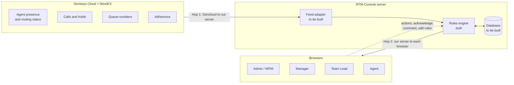
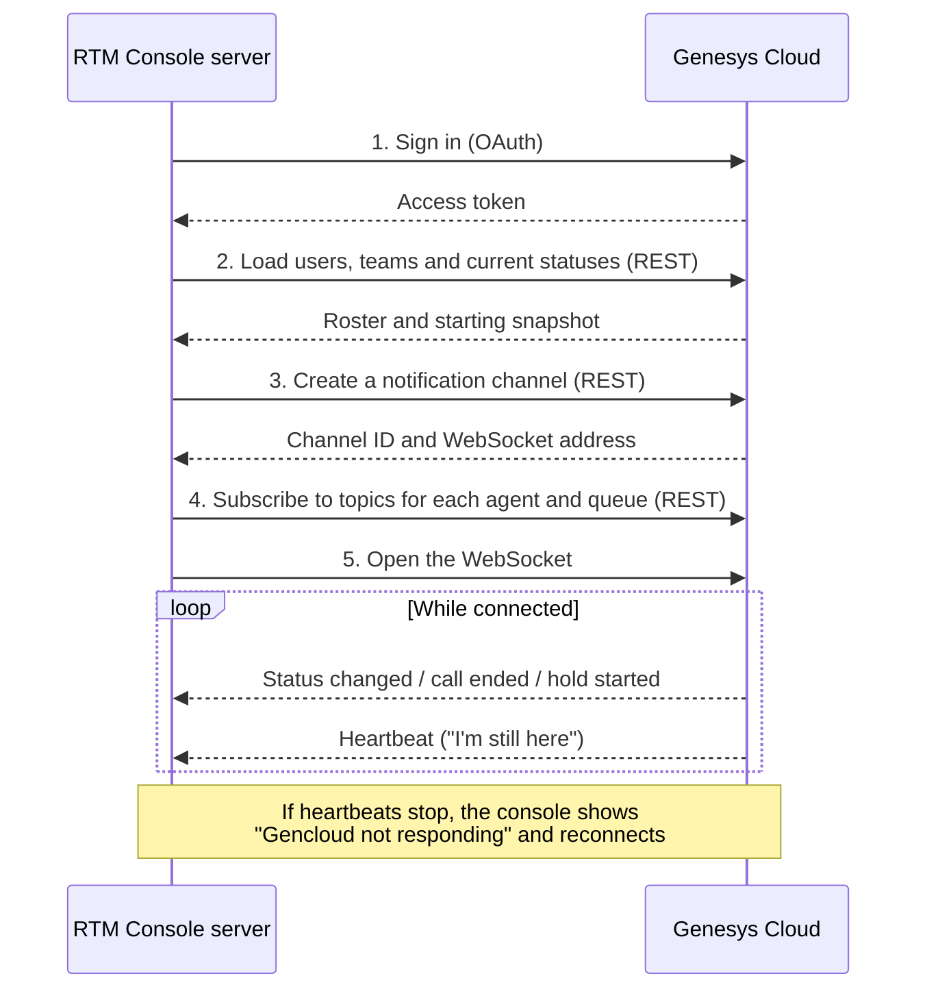
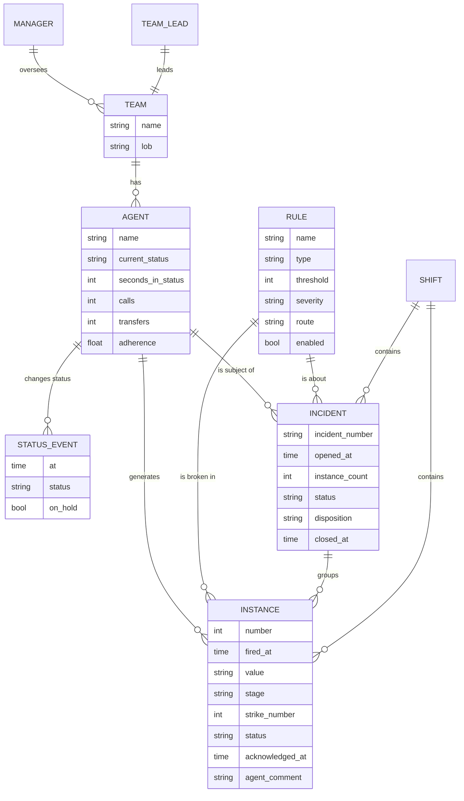
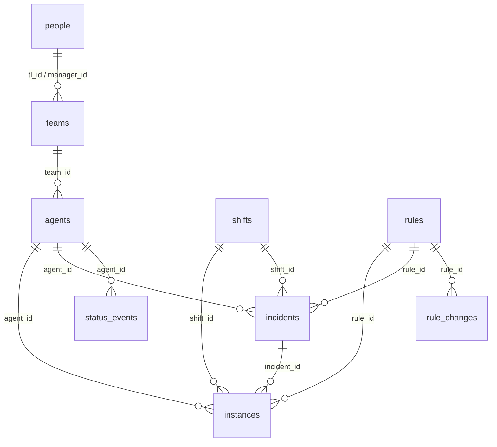
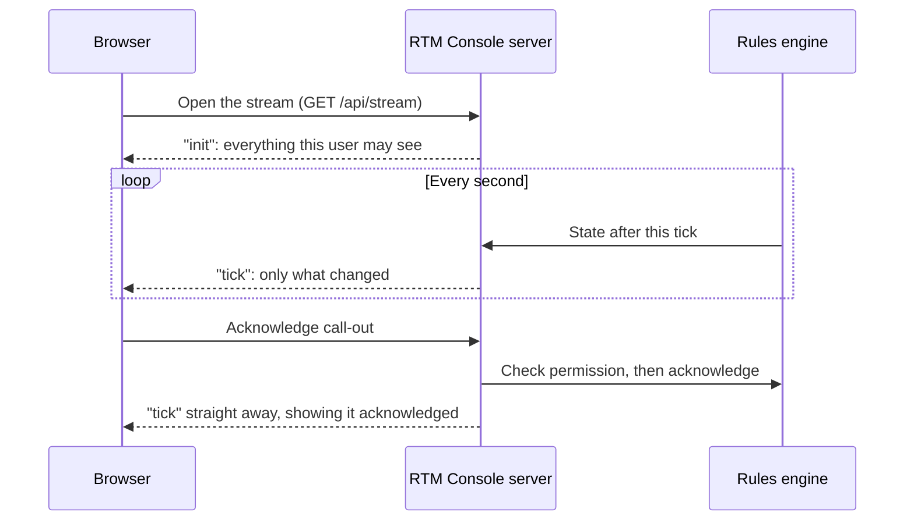

# RTM Console · Data Architecture

How data enters the console, what the console does with it, where it should be stored, and how the pieces relate.

| | |
| --- | --- |
| **Audience** | Backend developers, and stakeholders reviewing the design |
| **Status** | Proposal for review. The database choice is still open (see [Section 7](#7-choosing-the-database)) |
| **Reflects** | The application as it is on `main`, October 2026 |
| **Owner** | BITS Automation Team |

---

## Contents

1. [Summary](#1-summary)
2. [The big picture](#2-the-big-picture)
3. [Gencloud API and WebSockets, explained](#3-gencloud-api-and-websockets-explained)
4. [The data model](#4-the-data-model)
5. [Where each field comes from](#5-where-each-field-comes-from)
6. [What needs to be stored](#6-what-needs-to-be-stored)
7. [Choosing the database](#7-choosing-the-database)
8. [Proposed schema](#8-proposed-schema)
9. [How the browser talks to the server](#9-how-the-browser-talks-to-the-server)
10. [Decisions needed](#10-decisions-needed)
11. [Glossary](#11-glossary)

---

## 1. Summary

RTM Console watches what agents are doing, checks it against rules, and escalates repeat breaches. Today it runs on simulated or imported data and **stores nothing**: everything is held in memory and lost when the server restarts.

To go live, three things have to be built. This document is the brief for all three.

| # | What is missing | In one line |
| --- | --- | --- |
| 1 | **A live data feed** | Connect to Genesys Cloud ("Gencloud") so real agent statuses arrive as they happen |
| 2 | **A database** | Save rules, call-outs and incidents so they survive a restart and can be reported on |
| 3 | **Real identities** | Link everything by ID instead of by name, and take the signed-in user from SSO |

> [!IMPORTANT]
> **The short answer on the database:** the data is relational. Teams have agents, agents generate call-outs, call-outs roll up into incidents, and every screen filters and counts across those links. **We recommend PostgreSQL.** MongoDB can work, but it would mean doing by hand what a relational database does for free. The reasoning is in [Section 7](#7-choosing-the-database).

---

## 2. The big picture

Data makes two separate journeys. Keeping them apart is the key to understanding the system.



| | Hop 1 | Hop 2 |
| --- | --- | --- |
| **From → to** | Genesys Cloud → our server | Our server → each user's browser |
| **Carries** | Raw facts: "Joshua went into ACW at 10:14:05" | The console's view: agent grid, call-outs, incidents, scoped to what that user may see |
| **Status** | **Not built.** A stub exists | **Built and working** |
| **Who builds it** | Backend developer | Done; may be revisited |

Between the two hops sits the **rules engine**. It is the only part that makes decisions. It keeps a clock, tracks how long each agent has been in their current status, checks 14 rules every second, counts strikes, and decides who gets told. It is already built and unit tested, and it does not care where its data comes from.

---

## 3. Gencloud API and WebSockets, explained

These two terms come up together and are easy to mix up. They describe **Hop 1**: how our server gets data out of Genesys.

### Two ways to get data from Genesys

| | REST API | Notifications (WebSocket) |
| --- | --- | --- |
| **How it works** | We ask a question, Genesys answers. One request, one response | We open a connection once and Genesys **pushes** changes to us as they happen |
| **Like** | Phoning to ask "what's the status now?" | Staying on the line and being told the moment something changes |
| **Good for** | Things that rarely change, or a starting snapshot | Things that change constantly |
| **We use it for** | Who is on shift, team structure, the first snapshot of everyone's status | Every status change, call end and hold, live |

We need **both**. REST loads the starting picture; the WebSocket keeps it current. Polling REST alone every few seconds for hundreds of agents would be slow, would hit Genesys rate limits, and would miss short events such as a 12-second call.

### How the live connection works



### What we would subscribe to

| We need | Genesys source | Feeds |
| --- | --- | --- |
| Agent presence (Available, Break, Meal, Offline…) | Notification topic `v2.users.{id}.presence` | Agent status and most timer rules |
| Routing status (Interacting, Idle, Not Responding…) | Notification topic `v2.users.{id}.routingStatus` | On Call / Available / ACW |
| Calls, holds, transfers, wrap-up | Notification topic `v2.users.{id}.conversations` | Short call, Long call, Long hold, Transfer rate |
| Queue numbers (waiting, service level, abandon) | Analytics queue observations and aggregates | Queue tiles and queue rules |
| Users, teams, managers | Users and Groups/Teams REST APIs | Roster and role scoping |
| Adherence | **NiceIEX**, not Genesys | Adherence breach rule |

> [!WARNING]
> **To confirm with the Genesys administrator before building.** These are the points most likely to change the design:
>
> - **Limits.** A notification channel accepts a limited number of topic subscriptions (about 1,000), and each agent needs about three. A floor of several hundred agents will need **several channels**. Confirm the current limits.
> - **Sign-in type.** Confirm which OAuth grant our integration is allowed to use and that it may subscribe to other users' presence and conversation topics.
> - **Channel lifetime.** Channels expire (about every 24 hours) and must be renewed without losing events.
> - **Org structure.** Confirm where Team → Team Lead → Manager → LOB is held. If it is not in Genesys, we need another source (HR system, or a table we maintain).
> - **Adherence.** Confirm how NiceIEX exposes it (API, file drop, or not at all in real time).
>
> The topic names above are from Genesys Cloud's public documentation and should be checked against the current version.

### Where "WebSockets" might also mean Hop 2

The other place a WebSocket could appear is between our server and the browser. Today that hop uses **Server-Sent Events (SSE)**, a simpler one-way push that suits this job: the server pushes updates, and the browser sends actions as ordinary requests. It works and does not need to change. Switching it to a WebSocket is optional and discussed in [Section 9](#9-how-the-browser-talks-to-the-server).

---

## 4. The data model

Five things matter, plus the people who sign in.



### What each one is

| Entity | Plain meaning | Created by | Changes |
| --- | --- | --- | --- |
| **Team** | A group of agents with one Team Lead and one Manager | Org data | Rarely |
| **Agent** | A person on the floor, with their live status and today's counters | Roster, then the feed | Every second |
| **Rule** | One thing the console watches for, with its threshold and who to tell | Seeded with 14 defaults | When an Admin or Manager edits it |
| **Instance** | One call-out: a rule fired for an agent (or for the queue) at a moment | The rules engine | When acknowledged or commented on |
| **Incident** | An investigation, opened when one agent breaks one rule three times in a shift | The rules engine | Open → Investigating → Closed |
| **Status event** | A raw fact from the feed: this agent changed to this status at this time | The feed | Never (append-only) |
| **Shift** | One working day's worth of data. Strikes reset per shift | To be designed | Once at start, once at end |

### How they connect, in words

- A **Manager** oversees several **Teams**. A **Team Lead** leads exactly one. This is what decides who can see what.
- An **Agent** belongs to one **Team**.
- When an agent breaks a **Rule**, the engine writes an **Instance**. Each instance records the strike number for that agent and that rule.
- Strike 1 is a private nudge to the agent. Strike 2 goes to the Team Lead. Strike 3 goes to Ops and opens an **Incident**.
- An **Incident** belongs to one agent and one rule. There is at most one open incident per agent per rule; later strikes add to its count.
- Queue-level rules (backlog, service level, abandon) write instances against **the floor**, not an agent, and never open incidents.

> [!CAUTION]
> **Everything is currently linked by name, not by ID.** An instance points at its agent by the agent's name, at its rule by the rule's name, and at its team by the team's name. That is fine in memory but will fail in a database as soon as two agents share a name or someone is renamed. **Introducing real IDs is the first schema task**, and the Genesys user ID is the natural key for agents.

---

## 5. Where each field comes from

The full definitions are in [`lib/types.ts`](../lib/types.ts). This section maps each field to its source so the gaps are visible.

**Key:** ✅ available from the source · ⚙️ worked out by the console · ❓ source not confirmed

### Agent

| Field | Meaning | Source | |
| --- | --- | --- | --- |
| `id` | Unique identifier | Genesys user ID | ✅ (today it is just a row number) |
| `name` | Display name | Genesys user | ✅ |
| `team` | Team membership | Org data | ❓ |
| `state` | One of seven console states | Genesys presence + routing status, mapped | ✅ needs a mapping table |
| `stTime` | Seconds in the current state | Engine timer | ⚙️ |
| `onHold`, `holdTime` | On hold, and for how long | Genesys conversation events; engine timer | ✅ / ⚙️ |
| `calls`, `shortCalls`, `transfers` | Today's counters | Counted by the engine from call-end events | ⚙️ |
| `aht` | Average handle time | Engine, moving average of call lengths | ⚙️ |
| `adh` | Shift adherence % | NiceIEX | ❓ |
| `strikes` | Strike count per rule, this shift | Engine | ⚙️ |

### The seven console states

Genesys has many more statuses than the console. They must be mapped down to seven.

| Console state | Typical Genesys values |
| --- | --- |
| On Call | Routing status *Interacting* / *Communicating*; presence *On Queue* while on a call |
| Available | *On Queue* and *Idle*; *Available* |
| ACW | After-call work / wrap-up |
| Aux Break | *Break*, *Meal* |
| Aux Personal | *Away*, *Busy*, *Meeting*, *Training*, and anything unrecognised |
| Outbound | An outbound conversation |
| Offline | *Offline*, logged out |

> [!NOTE]
> A first version of this mapping already exists in `guessState()` in `lib/csv/parse.ts`, used by the file import. The live adapter should use an agreed mapping table instead of guessing, ideally editable without a code change.

### Queue numbers

| Field | Meaning | Source | |
| --- | --- | --- | --- |
| `cq` | Calls waiting now | Genesys queue observations | ✅ real-time only, not in interval exports |
| `sl` | Service level % | Genesys queue aggregates | ✅ |
| `asa` | Average speed of answer, seconds | Genesys queue aggregates | ✅ |
| `ab` | Abandon % | Genesys queue aggregates | ✅ |

The console currently treats the floor as **one queue**. The October export we reviewed contains 48 queues. Whether the console should show a total, or one set of numbers per line of business, is an open decision ([Section 10](#10-decisions-needed)).

### Rule, Instance, Incident

These are produced and owned by the console; nothing comes from Genesys.

| Entity | Fields | Notes |
| --- | --- | --- |
| **Rule** | `id`, `name`, `type`, `cond`, `thr`, `unit`, `sev`, `route`, `on` | 14 defaults. Only threshold, severity, route and on/off are editable |
| **Instance** | `n`, `t`, `agent`, `team`, `rule`, `ruleId`, `val`, `stage`, `sev`, `status`, `ackT`, `strikes`, `inc`, `cmt`, `cond` | `cond` is a snapshot of the rule's threshold at the moment it fired, so later rule edits do not rewrite history |
| **Incident** | `inc`, `t`, `agent`, `team`, `rule`, `ruleId`, `instances`, `status`, `disposition`, `closedT` | Numbered `INC-2026-NNNN` |

Times (`t`, `ackT`, `closedT`) are currently **seconds since midnight**, with no date. That must become a full timestamp once data is stored across days.

---

## 6. What needs to be stored

Not everything belongs in a database. Agent timers change every second and can be rebuilt from the feed; call-outs and incidents are business records and must never be lost.

| Data | Store it? | Why | Volume |
| --- | --- | --- | --- |
| **Rules** | **Yes, first** | An edited threshold must survive a restart | 14 rows |
| **Rule change history** | Yes | Audit: who changed which threshold, and when | Low |
| **Instances** (the ledger) | **Yes** | The core business record; exported and reported on | Hundreds to low thousands per shift |
| **Incidents** | **Yes** | Investigations run over hours or days | Tens per shift |
| **Acknowledgements and comments** | Yes (on the instance) | Response time and the agent's reason are reported | – |
| **Teams, agents, org structure** | Yes, as a synced copy | Needed for history even after someone leaves or moves team | Hundreds |
| **Strike counts** | Yes, or rebuild from instances | Lets the engine resume mid-shift after a restart | – |
| **Raw status events** | Optional but recommended | Lets a past day be replayed and disputes be checked | **Largest by far**: tens of thousands per shift |
| **Live timers** (`stTime`, `holdTime`) | No | Recomputed from the last status event | – |
| **Queue numbers** | Optional | Useful for trend charts | Low |

### The restart problem

Today a restart wipes the shift. With a database the engine should be able to **resume**: reload today's rules, strike counts, open instances and incidents, take a fresh snapshot of statuses from Genesys, and carry on. This is the most important behaviour for the backend to get right, and it is why strike counts and "which rules have already fired this episode" need to be recoverable.

---

## 7. Choosing the database

The open question is whether this data "can be passed as relational". **It can, and it already is relational in shape.** Here is the reasoning.

### What the application actually does with data

| The console needs to… | Example | Relational | Document |
| --- | --- | --- | --- |
| Filter by a chain of ownership | "Call-outs for agents in teams under this Manager" | A join | Duplicate manager and team onto every call-out, and update them all when someone moves |
| Count and group | "Call-outs per rule, split by stage" for the dashboards | `GROUP BY` | Aggregation pipeline |
| Enforce a business rule | "At most one open incident per agent per rule" | A unique index does it | Possible with a partial unique index; easier to get wrong |
| Change several things at once | Strike 3: write the instance **and** open the incident | One transaction | Multi-document transactions exist but need a replica set and more care |
| Keep history honest | Show an old call-out with the agent's team *at the time* | Foreign keys plus a snapshot column | Natural: embed the snapshot |
| Store irregular raw payloads | Raw Genesys events, which vary by type | A `JSONB` column | Natural |
| Export to CSV | Ledger and incident register | Straightforward | Straightforward |

### Side by side

| | PostgreSQL | MongoDB |
| --- | --- | --- |
| **Fit for this data** | Strong. The model is five linked entities | Workable, but the links are maintained in application code |
| **Role scoping** (who sees what) | Joins and indexes | Denormalised fields that must be kept in sync |
| **Dashboards and exports** | Plain SQL | Aggregation pipelines |
| **Guarantees** (no duplicate open incident, no orphan call-outs) | Enforced by the database | Enforced mostly by our code |
| **Raw Genesys events** | Good, via `JSONB` | Very good |
| **Reporting tools** (Power BI, Excel, etc.) | Connect directly | Usually need a connector or an export step |
| **Changing the shape later** | Migrations required | More flexible |
| **Hosting** | AWS RDS, Azure, on-prem; widely supported | Atlas or self-hosted |
| **Team familiarity** | Used on other BITS projects | To be confirmed |

### Recommendation

> [!IMPORTANT]
> **Use PostgreSQL.** The console's data is a small, stable set of linked records, and almost every screen is a filter or a count across those links. PostgreSQL enforces the rules we care about (one open incident per agent per rule, every call-out belongs to a real agent and rule) so they cannot be broken by a bug.
>
> The one area where a document store is the more natural fit is the **raw Genesys event log**, and PostgreSQL's `JSONB` column type handles that well. We get both in one system.

**Choose MongoDB instead if** the team that will run the service already operates MongoDB and not PostgreSQL, or if the plan is mainly to archive raw Genesys payloads and do little reporting. Neither appears to be the case, but both are worth confirming.

Either way, the data shapes in [Section 4](#4-the-data-model) stay the same. The engine does not talk to the database directly, so the choice is isolated to one storage layer.

---

## 8. Proposed schema

A starting point for review, not a final design. Both options are shown so the difference is concrete.

### Option A: PostgreSQL (recommended)



```sql
-- People who lead: team leads and managers. Agents are separate.
CREATE TABLE people (
  id            UUID PRIMARY KEY,
  genesys_id    TEXT UNIQUE,              -- null if they are not a Genesys user
  name          TEXT NOT NULL,
  email         TEXT UNIQUE               -- matched against the SSO sign-in
);

CREATE TABLE teams (
  id            UUID PRIMARY KEY,
  name          TEXT NOT NULL UNIQUE,
  lob           TEXT NOT NULL,
  tl_id         UUID NOT NULL REFERENCES people(id),
  manager_id    UUID NOT NULL REFERENCES people(id)
);

CREATE TABLE agents (
  id            UUID PRIMARY KEY,
  genesys_id    TEXT NOT NULL UNIQUE,     -- the stable key from Genesys
  name          TEXT NOT NULL,
  email         TEXT,
  team_id       UUID NOT NULL REFERENCES teams(id),
  active        BOOLEAN NOT NULL DEFAULT TRUE
);

-- The 14 rules. Seeded once; only four columns are editable.
CREATE TABLE rules (
  id            TEXT PRIMARY KEY,         -- 'acw', 'auxp', 'long', ...
  name          TEXT NOT NULL,
  type          TEXT NOT NULL CHECK (type IN ('duration','event','ratio','queue','system')),
  condition     TEXT NOT NULL,
  unit          TEXT NOT NULL,
  threshold     INTEGER NOT NULL CHECK (threshold >= 1),
  severity      TEXT NOT NULL CHECK (severity IN ('warn','crit')),
  route         TEXT NOT NULL CHECK (route IN ('nudge','lead','nudgeonly','leadonly')),
  enabled       BOOLEAN NOT NULL DEFAULT TRUE
);

CREATE TABLE rule_changes (
  id            BIGSERIAL PRIMARY KEY,
  rule_id       TEXT NOT NULL REFERENCES rules(id),
  changed_by    UUID NOT NULL REFERENCES people(id),
  changed_at    TIMESTAMPTZ NOT NULL DEFAULT now(),
  field         TEXT NOT NULL,
  old_value     TEXT,
  new_value     TEXT
);

-- One working day. Strikes and incident numbering are per shift.
CREATE TABLE shifts (
  id            UUID PRIMARY KEY,
  starts_at     TIMESTAMPTZ NOT NULL,
  ends_at       TIMESTAMPTZ,
  source        TEXT NOT NULL CHECK (source IN ('live','replay'))
);

CREATE TABLE incidents (
  id            UUID PRIMARY KEY,
  number        TEXT NOT NULL UNIQUE,     -- INC-2026-0001
  shift_id      UUID NOT NULL REFERENCES shifts(id),
  agent_id      UUID NOT NULL REFERENCES agents(id),
  rule_id       TEXT NOT NULL REFERENCES rules(id),
  team_id       UUID NOT NULL REFERENCES teams(id),   -- team at the time
  opened_at     TIMESTAMPTZ NOT NULL,
  instances     INTEGER NOT NULL,
  status        TEXT NOT NULL CHECK (status IN ('Open','Investigating','Closed')),
  disposition   TEXT,
  closed_at     TIMESTAMPTZ,
  closed_by     UUID REFERENCES people(id)
);
-- The business rule, enforced by the database:
-- at most one incident that is not Closed per agent, per rule, per shift.
CREATE UNIQUE INDEX one_open_incident
  ON incidents (shift_id, agent_id, rule_id) WHERE status <> 'Closed';

-- The ledger. One row per call-out.
CREATE TABLE instances (
  id              BIGSERIAL PRIMARY KEY,
  shift_id        UUID NOT NULL REFERENCES shifts(id),
  number          INTEGER NOT NULL,                  -- the "#" shown on the ledger
  fired_at        TIMESTAMPTZ NOT NULL,
  agent_id        UUID REFERENCES agents(id),        -- null for queue and floor call-outs
  team_id         UUID REFERENCES teams(id),         -- team at the time; null for the floor
  rule_id         TEXT NOT NULL REFERENCES rules(id),
  condition_text  TEXT NOT NULL,                     -- threshold as it was when this fired
  value           TEXT NOT NULL,
  stage           TEXT NOT NULL CHECK (stage IN ('nudge','lead','ops')),
  severity        TEXT NOT NULL CHECK (severity IN ('warn','crit','esc')),
  strike          INTEGER NOT NULL DEFAULT 0,
  incident_id     UUID REFERENCES incidents(id),
  status          TEXT NOT NULL CHECK (status IN ('open','acked')),
  acked_at        TIMESTAMPTZ,
  acked_by        UUID REFERENCES people(id),
  agent_comment   TEXT CHECK (char_length(agent_comment) <= 140),
  UNIQUE (shift_id, number)
);
CREATE INDEX instances_by_team   ON instances (shift_id, team_id, fired_at DESC);
CREATE INDEX instances_by_agent  ON instances (shift_id, agent_id, rule_id);
CREATE INDEX instances_open      ON instances (shift_id) WHERE status = 'open';

-- Raw feed, append-only. The largest table; partition by day.
CREATE TABLE status_events (
  id            BIGSERIAL,
  occurred_at   TIMESTAMPTZ NOT NULL,
  agent_id      UUID NOT NULL REFERENCES agents(id),
  state         TEXT NOT NULL,
  on_hold       BOOLEAN,
  call_ended    BOOLEAN NOT NULL DEFAULT FALSE,
  transferred   BOOLEAN,
  raw           JSONB,                    -- the original Genesys payload
  PRIMARY KEY (occurred_at, id)
) PARTITION BY RANGE (occurred_at);
```

**Strike counts** are not a table. They are `COUNT(*)` of instances per `(shift_id, agent_id, rule_id)`, which the `instances_by_agent` index makes cheap. The engine keeps them in memory while running and rebuilds them from this on restart.

### Option B: MongoDB

Four collections. Team and manager are copied onto each call-out so that role filtering does not need a join.

```jsonc
// rules  (14 documents)
{ "_id": "acw", "name": "Extended ACW", "type": "duration", "condition": "State ACW longer than",
  "threshold": 120, "unit": "s", "severity": "warn", "route": "nudge", "enabled": true,
  "history": [ { "by": "…", "at": "2026-10-06T09:12:00Z", "field": "threshold", "from": 120, "to": 150 } ] }

// agents
{ "_id": "<genesysUserId>", "name": "Joshua Lim", "email": "…", "active": true,
  "team": { "id": "…", "name": "Team Alpha", "lob": "PAP Intake",
            "tl": { "id": "…", "name": "Rina Velasco" }, "manager": { "id": "…", "name": "Ava Santiago" } } }

// instances  (the ledger)
{ "_id": "…", "shiftId": "…", "number": 42, "firedAt": "2026-10-06T10:42:17Z",
  "agent": { "id": "<genesysUserId>", "name": "Joshua Lim" },      // null for the floor
  "team":  { "id": "…", "name": "Team Alpha", "tlId": "…", "managerId": "…" },   // copied at fire time
  "rule":  { "id": "acw", "name": "Extended ACW", "condition": "State ACW longer than 120s" },
  "value": "2:00", "stage": "ops", "severity": "esc", "strike": 3,
  "incident": { "id": "…", "number": "INC-2026-0002" },
  "status": "open", "ackedAt": null, "ackedBy": null, "agentComment": null }

// incidents
{ "_id": "…", "number": "INC-2026-0002", "shiftId": "…",
  "agent": { "id": "<genesysUserId>", "name": "Joshua Lim" }, "team": { "id": "…", "name": "Team Alpha", "managerId": "…" },
  "rule": { "id": "acw", "name": "Extended ACW" },
  "openedAt": "2026-10-06T10:42:17Z", "instances": 3, "status": "Open", "disposition": null, "closedAt": null }
```

Indexes needed: `instances {shiftId, team.managerId, firedAt}`, `instances {shiftId, team.tlId, firedAt}`, `instances {shiftId, agent.id, rule.id}`, and a partial unique index on `incidents {shiftId, agent.id, rule.id}` where `status ≠ "Closed"`.

**What this costs compared with Option A:**

- When an agent changes team, past call-outs correctly keep the old team, but any code that reads the *current* team from an embedded copy will be wrong. The rule for which copy is authoritative has to be written down and followed.
- Opening an incident and writing its third call-out must be wrapped in a multi-document transaction, which requires a replica set.
- Nothing stops a call-out being written for an agent or rule that does not exist.

---

## 9. How the browser talks to the server

This is **Hop 2**. It is built and working; it is described here so the backend developer knows the existing contract.



| Aspect | How it works today |
| --- | --- |
| **Push to browser** | Server-Sent Events on `GET /api/stream`. One full snapshot on connect, then a small update every second |
| **Actions from browser** | Ordinary HTTP requests (acknowledge, comment, edit a rule, work an incident, export) |
| **Scoping** | Done on the server. A Team Lead's stream contains only their team; nothing else is ever sent to that browser |
| **Permissions** | Checked on every request against one table (`PERMS` in `lib/engine/scope.ts`) |
| **Identity** | A development-only "View as" selector. **Must be replaced by SSO** |

The full list of routes, with who may call each and the request and response shapes, is in the [README API reference](../README.md#api-reference).

### Should Hop 2 become a WebSocket?

| | Keep SSE (current) | Switch to WebSocket |
| --- | --- | --- |
| **Direction** | Server → browser only. Actions go by normal requests | Both ways on one connection |
| **Fits this app** | Yes. The server pushes; the browser occasionally acts | More than is needed |
| **Reconnects** | Automatic, built into the browser | Has to be written |
| **Through corporate proxies** | Plain HTTP, rarely blocked | Sometimes blocked or timed out |
| **Work required** | None | Rewrite the stream on both ends |

> [!TIP]
> **Recommendation: keep SSE for Hop 2.** The WebSocket that matters is the one to Genesys in Hop 1. Changing Hop 2 adds work and risk without a benefit the users would notice.

### One thing that does have to change

The engine lives in the memory of a single server process. That is fine for one server, but it means the console **cannot simply be run as several copies behind a load balancer**: each copy would run its own engine and they would disagree. The options, in order of effort:

1. **Run one instance** (simplest; fine for a first release) with the database for recovery.
2. **One engine, many web servers:** a single engine process publishes each tick to a message broker (for example Redis), and any number of web servers relay it to browsers.

---

## 10. Decisions needed

| # | Decision | Options | Who decides | Blocks |
| --- | --- | --- | --- | --- |
| 1 | **Database** | PostgreSQL *(recommended)* or MongoDB | Backend lead, BITS | Schema, hosting |
| 2 | **Genesys access** | Which OAuth grant; which topics we may subscribe to; current limits | Genesys administrator | The whole feed adapter |
| 3 | **Org structure source** | Genesys teams/groups, an HR system, or a table we maintain | WFM, Genesys administrator | Role scoping, the Team and Manager views |
| 4 | **Adherence source** | NiceIEX real-time API, periodic file, or leave the rule off | WFM | Adherence breach rule |
| 5 | **Status mapping** | The agreed list of Genesys statuses → seven console states | WFM | Every timer rule |
| 6 | **One floor or several** | One set of queue numbers for everyone, or one per LOB/queue group | WFM, Operations | Queue tiles, queue rules, schema |
| 7 | **What a shift is** | Start and end times; what happens to strikes and open incidents at rollover; overnight shifts | WFM, Operations | Strike counting, incident numbering |
| 8 | **Keep raw events?** | Yes (enables replay and audits; most storage) or no | BITS, data governance | Storage sizing |
| 9 | **Retention** | How long call-outs, incidents and raw events are kept | Data governance | Storage sizing, archiving |
| 10 | **Sign-in** | SSO provider, and how a signed-in person is matched to a role and a span | IT, BITS | Going live at all |

---

## 11. Glossary

| Term | Meaning |
| --- | --- |
| **Gencloud** | Genesys Cloud, the contact-centre platform agents take calls on |
| **NiceIEX** | The workforce-management system that holds schedules and adherence |
| **Feed** | The stream of facts from Gencloud into the console |
| **Feed adapter** | The piece of our server that connects to Gencloud and translates its events into the console's format |
| **Rules engine** | The part of the console that keeps the timers, checks the rules and decides escalation |
| **Call-out / Instance** | One occasion of a rule firing. "Instance" in the code and the ledger; "call-out" in conversation |
| **Strike** | The count of call-outs for one agent on one rule in one shift |
| **Incident** | An investigation opened at the third strike |
| **Stage** | How far a call-out went: Nudge (agent), Leader (Team Lead) or Ops |
| **Span** | The set of teams a person is allowed to see |
| **REST API** | Ask-and-answer communication: one request, one response |
| **WebSocket** | A connection that stays open so either side can send at any time |
| **SSE** | Server-Sent Events: a connection that stays open for the server to push to the browser, one way |
| **Topic** | In Genesys notifications, one kind of event for one user or queue that we subscribe to |
| **Relational database** | Stores data in linked tables and enforces the links (PostgreSQL) |
| **Document database** | Stores data as self-contained documents; links are managed by the application (MongoDB) |

---

*Related: [README](../README.md) for the code layout, API reference and backend task list · [Simulation Guide](RTM_Console_Simulation_Guide.pdf) for importing floor data.*
